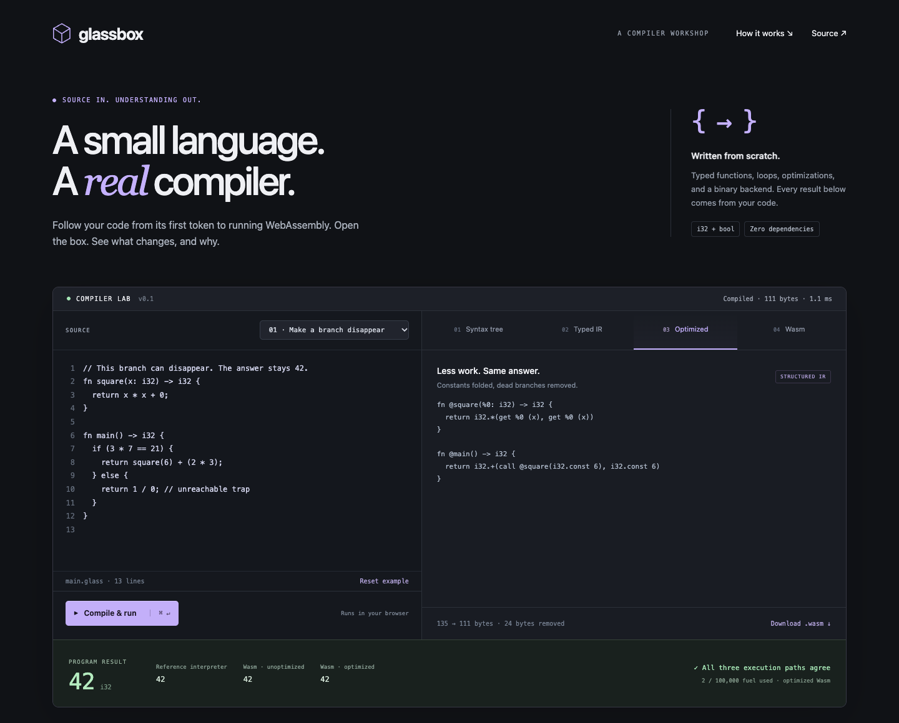

# Glassbox

A typed WebAssembly compiler with differential execution checks. Edit a small program and inspect its syntax tree, typed intermediate representation (IR), optimizations, and executable Wasm bytes.

[Open the compiler workshop](https://elliottbarnes.github.io/glassbox/) · [Reference guide](reference/guide.md) · [Compiler checks](https://github.com/elliottbarnes/glassbox/actions/workflows/check.yml)



## Engineering choices

- The lexer, parser, type checker, optimizer, interpreter, and Wasm binary encoder are implemented here, with no runtime dependencies or build step.
- Tests compare original and optimized IR interpretation with original and optimized Wasm execution. They cover arithmetic edges, traps, short-circuiting, scope, loops, and recursion.
- Optimizations retain evaluation order and observable traps. The workshop links transformations back to source and reports byte counts without claiming a speedup.
- Source limits, execution fuel, and a fresh Worker per browser job bound different parts of the pipeline. [Execution boundaries](reference/guide.md#execution-boundaries) explains what each limit does.

Start reading at [`compile` in docs/core.js](docs/core.js) and the [differential tests](test/compiler.test.js). The [architecture guide](reference/guide.md#architecture) walks through each stage.

## Run and check

Use **Node.js 24+** for tests, **Python 3** for the preview server, and a browser with WebAssembly and module Workers. No package installation, account, or API key is required.

```sh
git clone https://github.com/elliottbarnes/glassbox.git
cd glassbox
npm test
for file in docs/*.js; do node --check "$file"; done
python3 -m http.server 8080 --bind 127.0.0.1 --directory docs
```

Open **http://localhost:8080**. The default example returns `42` through the three displayed execution paths. Stop the server with **Ctrl+C**. Source edits stay in page memory and are lost on reload.

## Current limits

This is an educational compiler for `i32` and `bool`, with no heap, I/O, or imports. Its IR is structured, not SSA. Smaller output is not evidence of faster execution.

The 11 test groups include 250 generated programs that vary one arithmetic/call template, not a general grammar fuzzer. They do not automate browser Worker cancellation or the parent-page timeout. Shared frontend code can also share defects across execution paths. See [validation coverage](reference/guide.md#validation) for the exact scope.

## Go deeper

- [Language and grammar](reference/guide.md#the-language)
- [Library API](reference/guide.md#use-the-compiler-as-a-library)
- [Optimizations and their limits](reference/guide.md#optimizations-and-their-limits)
- [Troubleshooting](reference/guide.md#troubleshooting) and [contributing](reference/guide.md#contributing-and-extending-the-compiler)

MIT — see [LICENSE](LICENSE).
